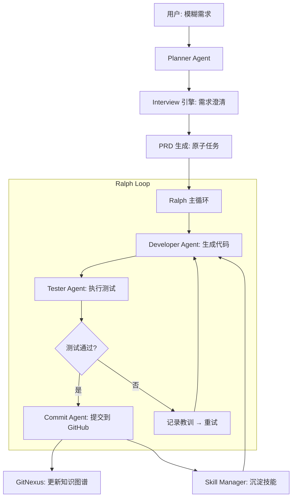

# 🦥 slotht-code-agent

> **慢即是快** —— 基于 Ralph 循环 + GitNexus 知识图谱 + Interview 需求澄清的自主编程 Agent 系统

## 核心特性

| 特性 | 说明 |
|------|------|
| 🎯 **Interview 需求澄清** | 模糊需求→结构化 PRD，选择题确认方向 |
| 🔄 **Ralph 循环执行** | 测试驱动，失败记录教训，自动修复 |
| 🧠 **GitNexus 知识图谱** | 动态索引项目，Agent 不再遗忘关键信息 |
| 🐙 **触手隔离** | OctoGent 风格上下文隔离，专注单模块 |
| 📚 **技能沉淀** | 完成任务后提取可复用模式 |
| 🤖 **GitHub 集成** | 测试通过后自动提交和创建 PR |

## 快速开始

### 安装

```bash
git clone https://github.com/your-org/slotht-code-agent.git
cd slotht-code-agent
npm install
npm run build
```

### 配置

```bash
cp .env.example .env
# 编辑 .env 填入 API Key
```

### 运行

```bash
# 启动 Interview 流程
npm run slotht -- interview "帮我开发一个用户登录系统"

# 或直接执行已有 PRD
npm run slotht -- execute prd.json
```

## 系统架构



## 模块说明

### 📋 Planner（规划者）
- **Interview 引擎** — 生成选择题，澄清需求
- **PRD 生成器** — 输出结构化任务列表

### ⚡ Executor（执行者）
- **Ralph 循环** — 测试驱动的迭代执行
- **Developer Agent** — 调用 LLM 生成代码

### 🧪 Tester（测试者）
- **测试生成器** — 自动生成单元测试
- **测试运行器** — 执行并分析结果

### 📦 Committer（提交者）
- **Git 操作** — 添加、提交、推送
- **PR 创建** — 自动创建 Pull Request

### 🧠 Graph（知识图谱）
- **GitNexus 封装** — 索引、查询、影响分析
- **增量更新** — 提交后自动更新

### 📚 Skill（技能）
- **技能提取** — 从完成的任务中提取模式
- **技能复用** — 新任务直接调用已有技能

## API 概览

```typescript
// Planner
interface Planner {
  interview(userInput: string): Promise<InterviewResult>;
  generatePRD(userInput: string, answers: Answer[]): Promise<PRD>;
}

// Executor
interface Executor {
  runLoop(prdPath: string, maxIterations?: number): Promise<ExecutionResult>;
}

// Graph
interface GraphUpdater {
  analyzeIncremental(changedFiles: string[]): Promise<void>;
  updateOnCommit(commitHash: string): Promise<void>;
}

// Skill
interface SkillManager {
  extractSkill(task: Task, codeChanges: string): Promise<Skill>;
  invokeSkill(skillName: string, context: Context): Promise<string>;
}
```

## 技术栈

- **运行时**: Node.js >= 20.0.0
- **语言**: TypeScript 5.5+
- **测试**: Vitest
- **Lint**: ESLint + Prettier
- **知识图谱**: GitNexus
- **GitHub**: @octokit/rest

## 贡献指南

1. Fork 仓库
2. 创建功能分支 (`git checkout -b feature/amazing-feature`)
3. 提交变更 (`git commit -m 'feat: add amazing feature'`)
4. 推送到分支 (`git push origin feature/amazing-feature`)
5. 创建 Pull Request

## 许可证

MIT
