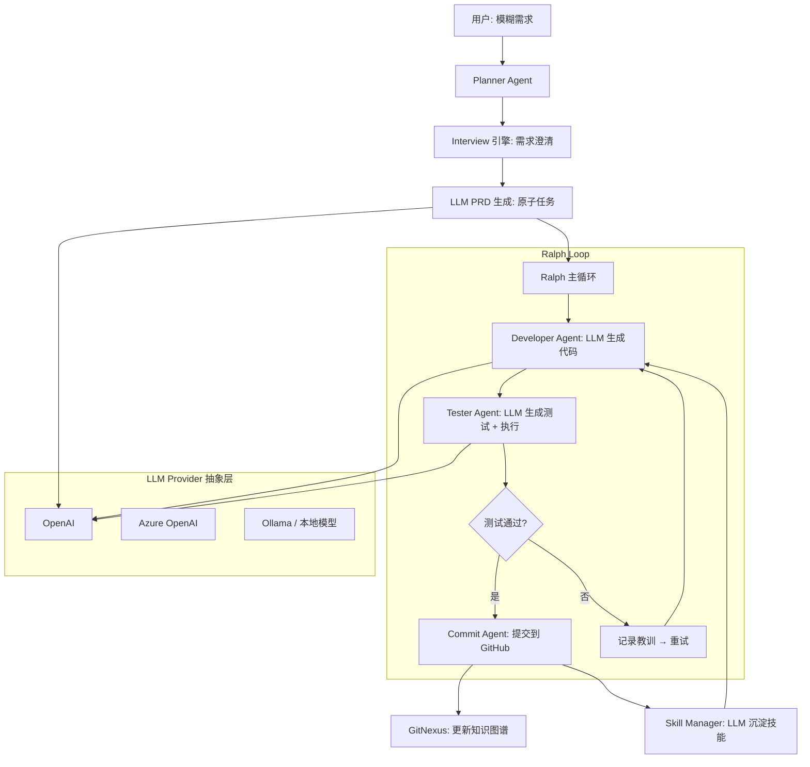

# 🦥 slotht-code-agent

> **慢即是快** —— 基于 Ralph 循环 + GitNexus 知识图谱 + Interview 需求澄清的自主编程 Agent 系统

## 核心特性

| 特性 | 说明 |
|------|------|
| 🎯 **Interview 需求澄清** | 模糊需求→结构化 PRD，选择题确认方向 |
| 🔄 **Ralph 循环执行** | 测试驱动，失败记录教训，自动修复 |
| 🧠 **GitNexus 知识图谱** | 动态索引项目，Agent 不再遗忘关键信息 |
| 🐙 **触手隔离** | OctoGent 风格上下文隔离，专注单模块 |
| 📚 **技能沉淀** | 完成任务后提取可复用模式 |
| 🤖 **GitHub 集成** | 测试通过后自动提交和创建 PR |
| 🔌 **多 LLM 支持** | OpenAI / Azure / Ollama 等多 Provider 切换 |

## 快速开始

### 安装

```bash
git clone https://github.com/your-org/slotht-code-agent.git
cd slotht-code-agent
npm install
npm run build
```

### 配置

```bash
cp .env.example .env
# 编辑 .env 填入 API Key
```

### 运行

```bash
# 启动 Interview 流程（交互式）
npm run slotht -- interview "帮我开发一个用户登录系统"

# 非交互模式（自动选择默认选项）
npm run slotht -- interview "帮我开发一个用户登录系统" --non-interactive

# 跳过 Interview，直接生成 PRD
npm run slotht -- interview "帮我开发一个用户登录系统" --skip-interview

# 执行已有 PRD
npm run slotht -- execute prd.json

# 只预览计划，不执行
npm run slotht -- execute prd.json --dry-run

# 查看项目状态
npm run slotht -- status
```

## 系统架构



## 模块说明

### 🔌 LLM 抽象层 (`src/llm/`)
- **Provider 接口** — 统一的 LLM 调用抽象
- **OpenAI Provider** — 支持 OpenAI / Azure / 兼容 API
- **工厂模式** — 支持 OpenAI、Azure、Ollama 等多 Provider
- **自动重试** — 指数退避 + 超时控制

### 📋 Planner（规划者）
- **Interview 引擎** — 生成选择题，交互式澄清需求
- **PRD 生成器** — 使用 LLM 输出结构化任务列表（降级时使用模板）

### ⚡ Executor（执行者）
- **Ralph 循环** — 测试驱动的迭代执行
- **Developer Agent** — 调用 LLM 生成完整代码

### 🧪 Tester（测试者）
- **LLM 测试生成** — 使用 LLM 生成有真实断言的测试
- **测试运行器** — 执行并分析结果

### 📦 Committer（提交者）
- **安全 Git 操作** — 使用 `execFile` 避免命令注入
- **PR 创建** — 自动创建 Pull Request

### 🧠 Graph（知识图谱）
- **GitNexus 封装** — 索引、查询、影响分析
- **增量更新** — 提交后自动更新

### 📚 Skill（技能）
- **LLM 技能提取** — 使用 LLM 从代码中提取可复用模式
- **技能复用** — 新任务直接调用已有技能

### 🛡️ Core（核心基础设施）
- **统一错误体系** — AppError + ErrorCode
- **结构化日志** — 基于 pino 的日志系统
- **进度日志** — 独立模块，避免循环依赖

## 配置说明

### LLM Provider 配置

```bash
# OpenAI（默认）
LLM_PROVIDER=openai
OPENAI_API_KEY=sk-xxx
OPENAI_MODEL=gpt-4o
OPENAI_BASE_URL=https://api.openai.com/v1

# Azure OpenAI
LLM_PROVIDER=azure
OPENAI_API_KEY=your-key
OPENAI_BASE_URL=https://your-resource.openai.azure.com/openai/deployments/gpt-4o

# Ollama（本地模型）
LLM_PROVIDER=ollama
OPENAI_BASE_URL=http://localhost:11434/v1
OPENAI_MODEL=llama3
```

### 请求配置

```bash
LLM_TIMEOUT_MS=120000    # 请求超时（毫秒）
LLM_MAX_RETRIES=3        # 最大重试次数
CIRCUIT_BREAKER_THRESHOLD=3  # 任务断路器阈值
```

## 开发

```bash
# 运行测试
npm test

# 测试 + 覆盖率
npm run test:coverage

# 代码检查
npm run lint

# 格式化
npm run format

# 开发模式（监听文件变更）
npm run dev
```

## License

MIT
